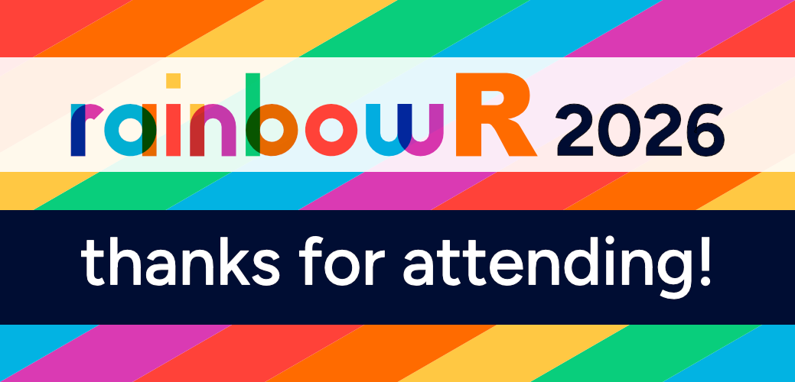

[ Closing remarks](https://youtu.be/jAp09OUMd6g){.btn .icon-link}

# What next?

We hope you enjoyed the rainbowR conference!

If you'd like to stay involved with the rainbowR community, here are some things you can do next:

## Everyone

- Keep participating in the rainbowR conference 2026 Discord server
- Follow and engage with us on [BlueSky](https://bsky.app/profile/rainbowr.org), [Mastodon](https://tech.lgbt/@rainbowR), and [LinkedIn](https://www.linkedin.com/company/rainbowr)
- Tell others about us!
- Visit <https://rainbowr.org> to find out more
- (Re)watch most talks from the conference on [YouTube](https://www.youtube.com/playlist?list=PLaSZCD8_cwh0MOQf1m8DrLheH1Tu0g2o_).

## LGBTQ+ folks
- [Join rainbowR](https://rainbowr.org/join) to receive an invitation to our Slack and join our newsletter
- Sign up for a rainbowR [buddy](https://rainbowr.org/buddies)
- Come to our [meetups](https://rainbowr.org/meetups)